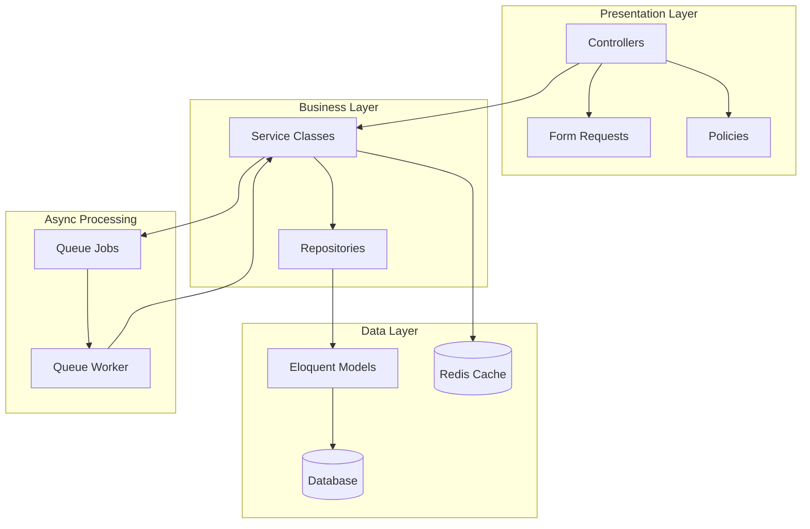
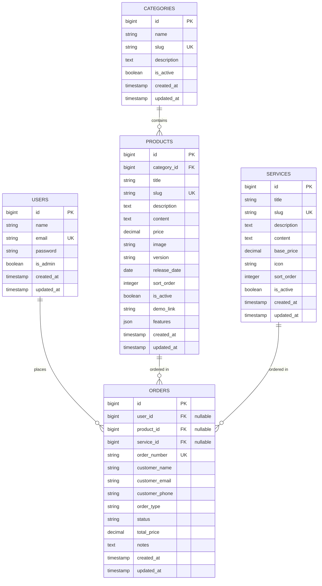

# Technical Design Document

## Overview

This document provides the technical design for making the ozanproject.com Laravel 13 application production-ready. The design addresses critical security vulnerabilities, database integrity issues, and architectural improvements required for safe production deployment.

### Current Architecture Issues

The application currently has several critical issues preventing production deployment:

1. **Missing Authorization**: Admin controllers lack authorization checks, allowing any authenticated user to perform admin actions
2. **Database Design Flaws**: No foreign key relationships between tables, preventing referential integrity enforcement
3. **Fat Controllers**: Business logic embedded directly in controllers (150+ lines), violating single responsibility principle
4. **No Validation Abstraction**: Validation rules duplicated across controllers without reusability
5. **Performance Issues**: No caching layer, missing database indexes on frequently queried columns
6. **Synchronous Long-Running Tasks**: Excel imports block HTTP requests, causing timeouts
7. **No Data Access Abstraction**: Direct Eloquent calls scattered throughout controllers, making testing difficult

### Design Objectives

This design provides:

1. **Security**: Complete authorization system using Laravel policies
2. **Data Integrity**: Foreign key relationships enforced at database level
3. **Clean Architecture**: Service layer pattern, repository pattern, and form request validation
4. **Performance**: Comprehensive caching strategy with cache invalidation, database indexes
5. **Scalability**: Queue system for asynchronous processing
6. **Testability**: Comprehensive test coverage including property-based tests for critical business logic
7. **Maintainability**: Clear separation of concerns, single responsibility principle
8. **Production Readiness**: Environment configuration, error handling, rate limiting, transaction management

### Technology Stack

- **Framework**: Laravel 13
- **Database**: MySQL/PostgreSQL (migrating from SQLite)
- **Cache**: Redis
- **Queue**: Redis or Database driver
- **Testing**: PHPUnit with fast-check/php-quickcheck for property-based testing
- **Static Analysis**: PHPStan (optional but recommended)


## Architecture

### High-Level Architecture



### Layered Architecture Pattern

The application follows a layered architecture pattern with clear separation of concerns:

**1. Presentation Layer**
- **Controllers**: Handle HTTP requests/responses, delegate to services
- **Form Requests**: Encapsulate validation and authorization logic
- **Policies**: Define authorization rules for resources
- **Middleware**: Handle cross-cutting concerns (auth, rate limiting, language)

**2. Business Logic Layer**
- **Services**: Contain business logic, coordinate between repositories
- **Jobs**: Handle asynchronous processing
- **Event Handlers**: React to domain events (cache invalidation, notifications)

**3. Data Access Layer**
- **Repositories**: Abstract database queries, return domain objects
- **Models**: Represent database tables, define relationships and scopes
- **Migrations**: Define database schema changes

**4. Infrastructure Layer**
- **Cache Service**: Manage caching strategy and invalidation
- **File Upload Service**: Handle file operations
- **Slug Generation Service**: Generate unique URL-friendly slugs

### Request Flow

1. **HTTP Request** arrives at Controller
2. **Rate Limiting Middleware** checks request limits
3. **Form Request** validates input and checks authorization
4. **Policy** verifies user permissions (via Form Request or Controller)
5. **Controller** delegates to **Service**
6. **Service** uses **Repository** to fetch/persist data
7. **Repository** queries **Model** which accesses **Database**
8. **Service** invalidates **Cache** if data changed
9. **Controller** returns HTTP Response

For long-running operations:
6. **Service** dispatches **Job** to **Queue**
7. **Controller** returns immediate response
8. **Queue Worker** processes job asynchronously
9. **Job** uses **Service** to perform work


## Components and Interfaces

### Authorization System

#### Policy Classes

Each resource has a dedicated policy class defining authorization rules:

```php
// app/Policies/ProductPolicy.php
namespace App\Policies;

use App\Models\Product;
use App\Models\User;

class ProductPolicy
{
    /**
     * Determine if user can view any products.
     */
    public function viewAny(User $user): bool
    {
        return $user->is_admin;
    }

    /**
     * Determine if user can view the product.
     */
    public function view(User $user, Product $product): bool
    {
        return $user->is_admin;
    }

    /**
     * Determine if user can create products.
     */
    public function create(User $user): bool
    {
        return $user->is_admin;
    }

    /**
     * Determine if user can update the product.
     */
    public function update(User $user, Product $product): bool
    {
        return $user->is_admin;
    }

    /**
     * Determine if user can delete the product.
     */
    public function delete(User $user, Product $product): bool
    {
        return $user->is_admin;
    }
}
```


**Policy Registration**: Policies are automatically discovered by Laravel's policy discovery feature. For explicit registration:

```php
// app/Providers/AuthServiceProvider.php
protected $policies = [
    Product::class => ProductPolicy::class,
    Order::class => OrderPolicy::class,
    Category::class => CategoryPolicy::class,
    Service::class => ServicePolicy::class,
    Portfolio::class => PortfolioPolicy::class,
    Testimonial::class => TestimonialPolicy::class,
    User::class => UserPolicy::class,
];
```

**Controller Integration**: Controllers use the `authorize()` method to enforce policies:

```php
public function index()
{
    $this->authorize('viewAny', Product::class);
    // ... rest of method
}

public function edit(Product $product)
{
    $this->authorize('update', $product);
    // ... rest of method
}
```


### Service Layer

#### ProductService

Handles all product-related business logic:

```php
// app/Services/ProductService.php
namespace App\Services;

use App\Models\Product;
use App\Repositories\ProductRepository;
use Illuminate\Support\Facades\DB;
use Illuminate\Support\Facades\Cache;

class ProductService
{
    public function __construct(
        private ProductRepository $repository,
        private FileUploadService $fileUploadService,
        private SlugGenerationService $slugService,
        private CacheService $cacheService
    ) {}

    /**
     * Create a new product.
     */
    public function create(array $data): Product
    {
        return DB::transaction(function () use ($data) {
            // Generate unique slug
            $data['slug'] = $this->slugService->generate($data['title'], Product::class);
            
            // Handle file upload
            if (isset($data['image'])) {
                $data['image'] = $this->fileUploadService->uploadProductImage($data['image']);
            }
            
            $product = $this->repository->create($data);
            
            // Invalidate cache
            $this->cacheService->invalidateProducts();
            
            return $product;
        });
    }

    /**
     * Update a product.
     */
    public function update(Product $product, array $data): Product
    {
        return DB::transaction(function () use ($product, $data) {
            // Regenerate slug if title changed
            if (isset($data['title']) && $data['title'] !== $product->title) {
                $data['slug'] = $this->slugService->generate($data['title'], Product::class, $product->id);
            }
            
            // Handle file upload
            if (isset($data['image'])) {
                // Delete old image
                if ($product->image) {
                    $this->fileUploadService->delete($product->image);
                }
                $data['image'] = $this->fileUploadService->uploadProductImage($data['image']);
            }
            
            $updated = $this->repository->update($product, $data);
            
            // Invalidate cache
            $this->cacheService->invalidateProducts();
            
            return $updated;
        });
    }

    /**
     * Delete a product.
     */
    public function delete(Product $product): bool
    {
        return DB::transaction(function () use ($product) {
            // Delete associated file
            if ($product->image) {
                $this->fileUploadService->delete($product->image);
            }
            
            $deleted = $this->repository->delete($product);
            
            // Invalidate cache
            $this->cacheService->invalidateProducts();
            
            return $deleted;
        });
    }

    /**
     * Get paginated products for admin listing.
     */
    public function getAdminListing(array $filters, int $perPage = 15): mixed
    {
        return $this->repository->paginatedWithFilters($filters, $perPage);
    }

    /**
     * Get active products by category for frontend.
     */
    public function getProductsByCategory(?int $categoryId, int $perPage = 12): mixed
    {
        $cacheKey = "products.category.{$categoryId}.page." . request('page', 1);
        
        return $this->cacheService->remember($cacheKey, 3600, function () use ($categoryId, $perPage) {
            return $this->repository->activeByCategory($categoryId, $perPage);
        });
    }
}
```


#### OrderService

Handles order management business logic:

```php
// app/Services/OrderService.php
namespace App\Services;

use App\Models\Order;
use App\Repositories\OrderRepository;
use App\Repositories\ProductRepository;
use App\Repositories\ServiceRepository;
use Illuminate\Support\Facades\DB;

class OrderService
{
    public function __construct(
        private OrderRepository $orderRepository,
        private ProductRepository $productRepository,
        private ServiceRepository $serviceRepository
    ) {}

    /**
     * Create a new order.
     */
    public function create(array $data): Order
    {
        return DB::transaction(function () use ($data) {
            // Generate unique order number
            $data['order_number'] = $this->generateOrderNumber();
            
            // Calculate total price based on order type
            $data['total_price'] = $this->calculatePrice($data);
            
            return $this->orderRepository->create($data);
        });
    }

    /**
     * Update order status.
     */
    public function updateStatus(Order $order, string $status): Order
    {
        return $this->orderRepository->update($order, ['status' => $status]);
    }

    /**
     * Calculate order price.
     */
    private function calculatePrice(array $data): float
    {
        if ($data['order_type'] === 'Produk' && isset($data['product_id'])) {
            $product = $this->productRepository->find($data['product_id']);
            return $product ? $product->price : 0;
        }
        
        if ($data['order_type'] === 'Layanan' && isset($data['service_id'])) {
            $service = $this->serviceRepository->find($data['service_id']);
            return $service ? $service->base_price : 0;
        }
        
        return $data['total_price'] ?? 0;
    }

    /**
     * Generate unique order number.
     */
    private function generateOrderNumber(): string
    {
        do {
            $number = 'ORD-' . date('Ymd') . '-' . strtoupper(\Illuminate\Support\Str::random(4));
            $exists = $this->orderRepository->findByOrderNumber($number);
        } while ($exists);
        
        return $number;
    }
}
```

#### Infrastructure Services

**FileUploadService**: Handles all file upload operations:

```php
// app/Services/FileUploadService.php
namespace App\Services;

use Illuminate\Http\UploadedFile;
use Illuminate\Support\Facades\Storage;

class FileUploadService
{
    /**
     * Upload product image.
     */
    public function uploadProductImage(UploadedFile $file): string
    {
        $this->validateImage($file);
        return $file->store('products', 'public');
    }

    /**
     * Delete file from storage.
     */
    public function delete(string $path): bool
    {
        if (Storage::disk('public')->exists($path)) {
            return Storage::disk('public')->delete($path);
        }
        return false;
    }

    /**
     * Validate image file.
     */
    private function validateImage(UploadedFile $file): void
    {
        if (!in_array($file->extension(), ['jpg', 'jpeg', 'png', 'webp'])) {
            throw new \InvalidArgumentException('Invalid image format');
        }
        
        if ($file->getSize() > 2048 * 1024) { // 2MB
            throw new \InvalidArgumentException('Image size exceeds 2MB limit');
        }
    }
}
```


**SlugGenerationService**: Generates unique URL-friendly slugs:

```php
// app/Services/SlugGenerationService.php
namespace App\Services;

use Illuminate\Support\Str;

class SlugGenerationService
{
    /**
     * Generate unique slug for a model.
     */
    public function generate(string $title, string $modelClass, ?int $excludeId = null): string
    {
        $slug = Str::slug($title);
        $originalSlug = $slug;
        $counter = 1;
        
        while ($this->slugExists($slug, $modelClass, $excludeId)) {
            $slug = $originalSlug . '-' . $counter;
            $counter++;
        }
        
        return $slug;
    }

    /**
     * Check if slug exists.
     */
    private function slugExists(string $slug, string $modelClass, ?int $excludeId): bool
    {
        $query = $modelClass::where('slug', $slug);
        
        if ($excludeId) {
            $query->where('id', '!=', $excludeId);
        }
        
        return $query->exists();
    }
}
```

**CacheService**: Manages caching and invalidation:

```php
// app/Services/CacheService.php
namespace App\Services;

use Illuminate\Support\Facades\Cache;

class CacheService
{
    /**
     * Remember value in cache.
     */
    public function remember(string $key, int $ttl, callable $callback): mixed
    {
        return Cache::remember($key, $ttl, $callback);
    }

    /**
     * Invalidate product caches.
     */
    public function invalidateProducts(): void
    {
        Cache::forget('products.catalog');
        Cache::flush('products.*'); // Pattern-based invalidation
    }

    /**
     * Invalidate category caches.
     */
    public function invalidateCategories(): void
    {
        Cache::forget('categories.active');
    }

    /**
     * Invalidate settings cache.
     */
    public function invalidateSettings(): void
    {
        Cache::forget('app.settings');
    }
}
```


### Repository Layer

#### ProductRepository

Abstracts all product data access:

```php
// app/Repositories/ProductRepository.php
namespace App\Repositories;

use App\Models\Product;
use Illuminate\Database\Eloquent\Collection;
use Illuminate\Contracts\Pagination\LengthAwarePaginator;

class ProductRepository
{
    /**
     * Get all products.
     */
    public function all(): Collection
    {
        return Product::all();
    }

    /**
     * Find product by ID.
     */
    public function find(int $id): ?Product
    {
        return Product::find($id);
    }

    /**
     * Find product by slug.
     */
    public function findBySlug(string $slug): ?Product
    {
        return Product::where('slug', $slug)->first();
    }

    /**
     * Get active products.
     */
    public function active(): Collection
    {
        return Product::active()->ordered()->get();
    }

    /**
     * Get products by category.
     */
    public function byCategory(int $categoryId): Collection
    {
        return Product::where('category_id', $categoryId)
            ->active()
            ->ordered()
            ->get();
    }

    /**
     * Get paginated active products by category.
     */
    public function activeByCategory(?int $categoryId, int $perPage = 12): LengthAwarePaginator
    {
        $query = Product::active()->ordered();
        
        if ($categoryId) {
            $query->where('category_id', $categoryId);
        }
        
        return $query->paginate($perPage);
    }

    /**
     * Get paginated products with filters for admin.
     */
    public function paginatedWithFilters(array $filters, int $perPage = 15): LengthAwarePaginator
    {
        $query = Product::ordered()->latest();
        
        if (!empty($filters['search'])) {
            $query->where(function($q) use ($filters) {
                $q->where('title', 'like', '%' . $filters['search'] . '%')
                  ->orWhere('description', 'like', '%' . $filters['search'] . '%');
            });
        }
        
        if (isset($filters['category_id'])) {
            $query->where('category_id', $filters['category_id']);
        }
        
        return $query->paginate($perPage);
    }

    /**
     * Create product.
     */
    public function create(array $data): Product
    {
        return Product::create($data);
    }

    /**
     * Update product.
     */
    public function update(Product $product, array $data): Product
    {
        $product->update($data);
        return $product->fresh();
    }

    /**
     * Delete product.
     */
    public function delete(Product $product): bool
    {
        return $product->delete();
    }
}
```

#### OrderRepository

Abstracts all order data access:

```php
// app/Repositories/OrderRepository.php
namespace App\Repositories;

use App\Models\Order;
use Illuminate\Database\Eloquent\Collection;
use Illuminate\Contracts\Pagination\LengthAwarePaginator;

class OrderRepository
{
    public function all(): Collection
    {
        return Order::all();
    }

    public function find(int $id): ?Order
    {
        return Order::find($id);
    }

    public function findByOrderNumber(string $orderNumber): ?Order
    {
        return Order::where('order_number', $orderNumber)->first();
    }

    public function pending(): Collection
    {
        return Order::pending()->get();
    }

    public function byCustomerEmail(string $email): Collection
    {
        return Order::where('customer_email', $email)->get();
    }

    public function paginated(int $perPage = 15): LengthAwarePaginator
    {
        return Order::latest()->paginate($perPage);
    }

    public function paginatedWithFilters(array $filters, int $perPage = 15): LengthAwarePaginator
    {
        $query = Order::latest();
        
        if (!empty($filters['search'])) {
            $query->where(function($q) use ($filters) {
                $q->where('order_number', 'like', '%' . $filters['search'] . '%')
                  ->orWhere('customer_name', 'like', '%' . $filters['search'] . '%')
                  ->orWhere('customer_email', 'like', '%' . $filters['search'] . '%');
            });
        }
        
        if (isset($filters['status'])) {
            $query->where('status', $filters['status']);
        }
        
        return $query->paginate($perPage);
    }

    public function create(array $data): Order
    {
        return Order::create($data);
    }

    public function update(Order $order, array $data): Order
    {
        $order->update($data);
        return $order->fresh();
    }

    public function delete(Order $order): bool
    {
        return $order->delete();
    }
}
```


### Form Request Validation

Form requests encapsulate validation and authorization logic:

```php
// app/Http/Requests/StoreProductRequest.php
namespace App\Http\Requests;

use Illuminate\Foundation\Http\FormRequest;

class StoreProductRequest extends FormRequest
{
    /**
     * Determine if the user is authorized to make this request.
     */
    public function authorize(): bool
    {
        return $this->user()->can('create', \App\Models\Product::class);
    }

    /**
     * Get the validation rules that apply to the request.
     */
    public function rules(): array
    {
        return [
            'title' => 'required|string|max:255',
            'category_id' => 'required|exists:categories,id',
            'price' => 'nullable|numeric|min:0',
            'is_active' => 'boolean',
            'sort_order' => 'integer|min:0',
            'description' => 'required|string',
            'content' => 'nullable|string',
            'image' => 'nullable|image|mimes:jpeg,png,jpg,webp|max:2048',
            'demo_link' => 'nullable|url|max:255',
            'features' => 'nullable|array',
            'features.*' => 'string',
            'version' => 'nullable|string|max:50',
            'release_date' => 'nullable|date',
        ];
    }

    /**
     * Get custom messages for validator errors.
     */
    public function messages(): array
    {
        return [
            'title.required' => 'Judul produk wajib diisi.',
            'category_id.required' => 'Kategori wajib dipilih.',
            'category_id.exists' => 'Kategori tidak valid.',
            'image.image' => 'File harus berupa gambar.',
            'image.max' => 'Ukuran gambar maksimal 2MB.',
        ];
    }
}
```


```php
// app/Http/Requests/UpdateProductRequest.php
namespace App\Http\Requests;

use Illuminate\Foundation\Http\FormRequest;

class UpdateProductRequest extends FormRequest
{
    public function authorize(): bool
    {
        $product = $this->route('product');
        return $this->user()->can('update', $product);
    }

    public function rules(): array
    {
        return [
            'title' => 'required|string|max:255',
            'category_id' => 'required|exists:categories,id',
            'price' => 'nullable|numeric|min:0',
            'is_active' => 'boolean',
            'sort_order' => 'integer|min:0',
            'description' => 'required|string',
            'content' => 'nullable|string',
            'image' => 'nullable|image|mimes:jpeg,png,jpg,webp|max:2048',
            'demo_link' => 'nullable|url|max:255',
            'features' => 'nullable|array',
            'features.*' => 'string',
            'version' => 'nullable|string|max:50',
            'release_date' => 'nullable|date',
        ];
    }
}
```

```php
// app/Http/Requests/StoreOrderRequest.php
namespace App\Http\Requests;

use Illuminate\Foundation\Http\FormRequest;

class StoreOrderRequest extends FormRequest
{
    public function authorize(): bool
    {
        return true; // Frontend users can create orders
    }

    public function rules(): array
    {
        return [
            'customer_name' => 'required|string|max:255',
            'customer_email' => 'nullable|email|max:255',
            'customer_phone' => 'required|string|max:50',
            'order_type' => 'required|in:Produk,Layanan',
            'product_id' => 'required_if:order_type,Produk|nullable|exists:products,id',
            'service_id' => 'required_if:order_type,Layanan|nullable|exists:services,id',
            'notes' => 'nullable|string|max:1000',
        ];
    }
}
```


```php
// app/Http/Requests/ImportProductsRequest.php
namespace App\Http\Requests;

use Illuminate\Foundation\Http\FormRequest;

class ImportProductsRequest extends FormRequest
{
    public function authorize(): bool
    {
        return $this->user()->can('create', \App\Models\Product::class);
    }

    public function rules(): array
    {
        return [
            'file' => 'required|file|mimes:xlsx,csv|max:5120', // 5MB max
        ];
    }

    public function messages(): array
    {
        return [
            'file.required' => 'File Excel wajib diupload.',
            'file.mimes' => 'File harus berformat Excel (xlsx) atau CSV.',
            'file.max' => 'Ukuran file maksimal 5MB.',
        ];
    }
}
```

### Queue Jobs

#### ImportProductsJob

Handles asynchronous Excel import processing:

```php
// app/Jobs/ImportProductsJob.php
namespace App\Jobs;

use App\Services\ProductService;
use Illuminate\Bus\Queueable;
use Illuminate\Contracts\Queue\ShouldQueue;
use Illuminate\Foundation\Bus\Dispatchable;
use Illuminate\Queue\InteractsWithQueue;
use Illuminate\Queue\SerializesModels;
use Illuminate\Support\Facades\Log;

class ImportProductsJob implements ShouldQueue
{
    use Dispatchable, InteractsWithQueue, Queueable, SerializesModels;

    /**
     * Number of times job may be attempted.
     */
    public $tries = 3;

    /**
     * Number of seconds to wait before retrying.
     */
    public $backoff = [60, 120, 300]; // 1 min, 2 min, 5 min

    /**
     * Create a new job instance.
     */
    public function __construct(
        private string $filePath,
        private int $userId
    ) {}

    /**
     * Execute the job.
     */
    public function handle(ProductService $productService): void
    {
        try {
            $rows = \Spatie\SimpleExcel\SimpleExcelReader::create($this->filePath)
                ->getRows();
            
            $count = 0;
            $errors = [];
            
            // Process in chunks of 100
            $rows->chunk(100)->each(function ($chunk) use ($productService, &$count, &$errors) {
                foreach ($chunk as $row) {
                    try {
                        // Skip empty or sample rows
                        if (empty($row['title']) || $row['title'] === 'Produk Contoh') {
                            continue;
                        }
                        
                        \Illuminate\Support\Facades\DB::transaction(function () use ($productService, $row, &$count) {
                            $productService->create([
                                'title' => $row['title'],
                                'category_id' => $row['category_id'] ?? null,
                                'price' => isset($row['price']) && is_numeric($row['price']) ? (float)$row['price'] : 0,
                                'description' => $row['description'] ?? '-',
                                'content' => $row['content'] ?? null,
                                'is_active' => isset($row['is_active']) ? (bool)$row['is_active'] : true,
                                'sort_order' => isset($row['sort_order']) && is_numeric($row['sort_order']) ? (int)$row['sort_order'] : 0,
                            ]);
                            
                            $count++;
                        });
                    } catch (\Exception $e) {
                        $errors[] = "Row {$count}: " . $e->getMessage();
                        Log::error('Excel import row failed', [
                            'row' => $row,
                            'error' => $e->getMessage()
                        ]);
                    }
                }
            });
            
            Log::info('Excel import completed', [
                'file' => $this->filePath,
                'user_id' => $this->userId,
                'count' => $count,
                'errors' => count($errors)
            ]);
            
        } catch (\Exception $e) {
            Log::error('Excel import job failed', [
                'file' => $this->filePath,
                'user_id' => $this->userId,
                'error' => $e->getMessage(),
                'trace' => $e->getTraceAsString()
            ]);
            
            throw $e; // Re-throw to trigger retry
        }
    }

    /**
     * Handle a job failure.
     */
    public function failed(\Throwable $exception): void
    {
        Log::critical('Excel import job failed after all retries', [
            'file' => $this->filePath,
            'user_id' => $this->userId,
            'error' => $exception->getMessage()
        ]);
    }
}
```


### Controller Refactoring

After service layer extraction, controllers become thin orchestrators:

```php
// app/Http/Controllers/Admin/ProductController.php (Refactored)
namespace App\Http\Controllers\Admin;

use App\Http\Controllers\Controller;
use App\Http\Requests\StoreProductRequest;
use App\Http\Requests\UpdateProductRequest;
use App\Http\Requests\ImportProductsRequest;
use App\Models\Product;
use App\Services\ProductService;
use App\Jobs\ImportProductsJob;
use Illuminate\Http\Request;

class ProductController extends Controller
{
    public function __construct(
        private ProductService $productService
    ) {}

    public function index(Request $request)
    {
        $this->authorize('viewAny', Product::class);
        
        $products = $this->productService->getAdminListing(
            $request->only(['search', 'category_id']),
            $request->input('per_page', 15)
        );
        
        return view('admin.pages.products.index', compact('products'));
    }

    public function create()
    {
        $this->authorize('create', Product::class);
        return view('admin.pages.products.create');
    }

    public function store(StoreProductRequest $request)
    {
        $product = $this->productService->create($request->validated());
        
        return redirect()
            ->route('admin.products.index')
            ->with('success', 'Produk berhasil ditambahkan.');
    }

    public function edit(Product $product)
    {
        $this->authorize('update', $product);
        return view('admin.pages.products.edit', compact('product'));
    }

    public function update(UpdateProductRequest $request, Product $product)
    {
        $this->productService->update($product, $request->validated());
        
        return redirect()
            ->route('admin.products.index')
            ->with('success', 'Produk berhasil diperbarui.');
    }

    public function destroy(Product $product)
    {
        $this->authorize('delete', $product);
        
        $this->productService->delete($product);
        
        return redirect()
            ->route('admin.products.index')
            ->with('success', 'Produk berhasil dihapus.');
    }

    public function importExcel(ImportProductsRequest $request)
    {
        $file = $request->file('file');
        $path = $file->store('imports', 'local');
        
        // Dispatch job for asynchronous processing
        ImportProductsJob::dispatch(storage_path('app/' . $path), auth()->id());
        
        return redirect()
            ->route('admin.products.index')
            ->with('success', 'Import sedang diproses. Anda akan menerima notifikasi setelah selesai.');
    }
}
```

**Note**: Controller reduced from 150+ lines to ~75 lines. Business logic moved to service layer.


## Data Models

### Database Schema Design

#### Entity Relationship Diagram




#### Database Indexes

**Products Table Indexes:**
```sql
-- Single column indexes
CREATE INDEX idx_products_slug ON products(slug);
CREATE INDEX idx_products_is_active ON products(is_active);
CREATE INDEX idx_products_category_id ON products(category_id);

-- Composite index for catalog queries
CREATE INDEX idx_products_catalog ON products(category_id, is_active, sort_order);
```

**Orders Table Indexes:**
```sql
-- Single column indexes
CREATE INDEX idx_orders_status ON orders(status);
CREATE INDEX idx_orders_customer_email ON orders(customer_email);
CREATE UNIQUE INDEX idx_orders_order_number ON orders(order_number);

-- Foreign key indexes
CREATE INDEX idx_orders_user_id ON orders(user_id);
CREATE INDEX idx_orders_product_id ON orders(product_id);
CREATE INDEX idx_orders_service_id ON orders(service_id);
```

**Categories Table Indexes:**
```sql
CREATE UNIQUE INDEX idx_categories_slug ON categories(slug);
CREATE INDEX idx_categories_is_active ON categories(is_active);
```

#### Migration Strategy

**Phase 1: Create Categories Table**

```php
// database/migrations/2024_xx_xx_create_categories_table.php
public function up()
{
    Schema::create('categories', function (Blueprint $table) {
        $table->id();
        $table->string('name');
        $table->string('slug')->unique();
        $table->text('description')->nullable();
        $table->boolean('is_active')->default(true);
        $table->timestamps();
        
        $table->index('slug');
        $table->index('is_active');
    });
}
```


**Phase 2: Migrate Existing Data**

```php
// database/migrations/2024_xx_xx_migrate_product_categories.php
public function up()
{
    // 1. Extract unique categories from products
    $uniqueCategories = DB::table('products')
        ->select('category_label')
        ->distinct()
        ->whereNotNull('category_label')
        ->pluck('category_label');
    
    // 2. Create category records
    foreach ($uniqueCategories as $categoryLabel) {
        DB::table('categories')->insertOrIgnore([
            'name' => $categoryLabel,
            'slug' => Str::slug($categoryLabel),
            'is_active' => true,
            'created_at' => now(),
            'updated_at' => now(),
        ]);
    }
    
    // 3. Add category_id column to products
    Schema::table('products', function (Blueprint $table) {
        $table->foreignId('category_id')->nullable()->after('id')->constrained('categories')->onDelete('set null');
        $table->index('category_id');
    });
    
    // 4. Populate category_id based on category_label
    $categories = DB::table('categories')->get();
    foreach ($categories as $category) {
        DB::table('products')
            ->where('category_label', $category->name)
            ->update(['category_id' => $category->id]);
    }
    
    // 5. Drop category_label column
    Schema::table('products', function (Blueprint $table) {
        $table->dropColumn('category_label');
    });
}

public function down()
{
    Schema::table('products', function (Blueprint $table) {
        $table->string('category_label', 100)->nullable()->after('slug');
    });
    
    // Restore category_label from category relationship
    $products = DB::table('products')->whereNotNull('category_id')->get();
    foreach ($products as $product) {
        $category = DB::table('categories')->find($product->category_id);
        if ($category) {
            DB::table('products')
                ->where('id', $product->id)
                ->update(['category_label' => $category->name]);
        }
    }
    
    Schema::table('products', function (Blueprint $table) {
        $table->dropForeign(['category_id']);
        $table->dropColumn('category_id');
    });
}
```


**Phase 3: Add Foreign Keys to Orders**

```php
// database/migrations/2024_xx_xx_add_foreign_keys_to_orders.php
public function up()
{
    Schema::table('orders', function (Blueprint $table) {
        // Add foreign key columns
        $table->foreignId('user_id')->nullable()->after('id')->constrained('users')->onDelete('set null');
        $table->foreignId('product_id')->nullable()->after('user_id')->constrained('products')->onDelete('set null');
        $table->foreignId('service_id')->nullable()->after('product_id')->constrained('services')->onDelete('set null');
        
        // Add indexes
        $table->index('user_id');
        $table->index('product_id');
        $table->index('service_id');
        $table->index('status');
        $table->index('customer_email');
    });
    
    // Populate product_id for existing product orders
    $productOrders = DB::table('orders')
        ->where('order_type', 'Produk')
        ->get();
    
    foreach ($productOrders as $order) {
        $product = DB::table('products')
            ->where('title', 'like', '%' . $order->item_name . '%')
            ->first();
        
        if ($product) {
            DB::table('orders')
                ->where('id', $order->id)
                ->update(['product_id' => $product->id]);
        }
    }
    
    // Populate service_id for existing service orders
    $serviceOrders = DB::table('orders')
        ->where('order_type', 'Layanan')
        ->get();
    
    foreach ($serviceOrders as $order) {
        $service = DB::table('services')
            ->where('title', 'like', '%' . $order->item_name . '%')
            ->first();
        
        if ($service) {
            DB::table('orders')
                ->where('id', $order->id)
                ->update(['service_id' => $service->id]);
        }
    }
}
```


**Phase 4: Add Performance Indexes**

```php
// database/migrations/2024_xx_xx_add_performance_indexes.php
public function up()
{
    Schema::table('products', function (Blueprint $table) {
        // Composite index for catalog queries (category + active + sort)
        $table->index(['category_id', 'is_active', 'sort_order'], 'idx_products_catalog');
        
        // Individual indexes
        $table->index('slug', 'idx_products_slug');
        $table->index('is_active', 'idx_products_is_active');
    });
}
```

### Eloquent Model Relationships

#### Product Model

```php
// app/Models/Product.php
namespace App\Models;

use Illuminate\Database\Eloquent\Model;
use Illuminate\Database\Eloquent\Relations\BelongsTo;
use Illuminate\Database\Eloquent\Relations\HasMany;

class Product extends Model
{
    protected $fillable = [
        'category_id',
        'title',
        'slug',
        'description',
        'content',
        'price',
        'image',
        'version',
        'release_date',
        'sort_order',
        'is_active',
        'demo_link',
        'features'
    ];

    protected $casts = [
        'is_active' => 'boolean',
        'price' => 'decimal:2',
        'features' => 'array',
        'release_date' => 'date',
    ];

    /**
     * Product belongs to a category.
     */
    public function category(): BelongsTo
    {
        return $this->belongsTo(Category::class);
    }

    /**
     * Product has many orders.
     */
    public function orders(): HasMany
    {
        return $this->hasMany(Order::class);
    }

    // Scopes
    public function scopeActive($query)
    {
        return $query->where('is_active', true);
    }

    public function scopeOrdered($query)
    {
        return $query->orderBy('sort_order', 'asc');
    }
}
```


#### Category Model

```php
// app/Models/Category.php
namespace App\Models;

use Illuminate\Database\Eloquent\Model;
use Illuminate\Database\Eloquent\Relations\HasMany;

class Category extends Model
{
    protected $fillable = ['name', 'slug', 'description', 'is_active'];

    protected $casts = [
        'is_active' => 'boolean',
    ];

    /**
     * Category has many products.
     */
    public function products(): HasMany
    {
        return $this->hasMany(Product::class);
    }

    public function scopeActive($query)
    {
        return $query->where('is_active', true);
    }
}
```

#### Order Model

```php
// app/Models/Order.php
namespace App\Models;

use Illuminate\Database\Eloquent\Model;
use Illuminate\Database\Eloquent\Relations\BelongsTo;

class Order extends Model
{
    protected $fillable = [
        'user_id',
        'product_id',
        'service_id',
        'order_number',
        'customer_name',
        'customer_email',
        'customer_phone',
        'order_type',
        'status',
        'total_price',
        'notes',
    ];

    protected $casts = [
        'total_price' => 'decimal:2',
    ];

    /**
     * Order belongs to a user (nullable).
     */
    public function user(): BelongsTo
    {
        return $this->belongsTo(User::class);
    }

    /**
     * Order belongs to a product (nullable).
     */
    public function product(): BelongsTo
    {
        return $this->belongsTo(Product::class);
    }

    /**
     * Order belongs to a service (nullable).
     */
    public function service(): BelongsTo
    {
        return $this->belongsTo(Service::class);
    }

    public function scopePending($query)
    {
        return $query->where('status', 'Pending');
    }
}
```


#### Service Model

```php
// app/Models/Service.php
namespace App\Models;

use Illuminate\Database\Eloquent\Model;
use Illuminate\Database\Eloquent\Relations\HasMany;

class Service extends Model
{
    protected $fillable = [
        'title',
        'slug',
        'description',
        'content',
        'base_price',
        'icon',
        'sort_order',
        'is_active'
    ];

    protected $casts = [
        'is_active' => 'boolean',
        'base_price' => 'decimal:2',
    ];

    /**
     * Service has many orders.
     */
    public function orders(): HasMany
    {
        return $this->hasMany(Order::class);
    }

    public function scopeActive($query)
    {
        return $query->where('is_active', true);
    }
}
```

#### User Model Enhancement

```php
// app/Models/User.php (additions)
use Illuminate\Database\Eloquent\Relations\HasMany;

class User extends Authenticatable
{
    // ... existing code ...

    /**
     * User has many orders.
     */
    public function orders(): HasMany
    {
        return $this->hasMany(Order::class);
    }

    /**
     * Check if user is an admin.
     */
    public function isAdmin(): bool
    {
        return $this->is_admin === true;
    }
}
```


## Correctness Properties

*A property is a characteristic or behavior that should hold true across all valid executions of a system—essentially, a formal statement about what the system should do. Properties serve as the bridge between human-readable specifications and machine-verifiable correctness guarantees.*

### Property Reflection

After analyzing all 15 requirements with their acceptance criteria, the following properties were identified as suitable for property-based testing:

**Identified Properties:**
1. Authorization checks occur for admin actions (Req 1.2)
2. Order number generation produces unique values (Req 5.3)
3. Slug generation produces URL-safe unique slugs (Req 5.4)
4. Cache invalidation occurs on model changes (Req 8.4, 8.5, 8.6)

**Consolidation Analysis:**
- Properties 8.4, 8.5, 8.6 all test the same behavior (cache invalidation on model change) but for different models. These can be combined into a single comprehensive property about cache invalidation.
- The remaining properties test distinct behaviors and provide unique validation value.

**Final Property Set** (after eliminating redundancy):
1. Authorization verification for admin actions
2. Order number uniqueness
3. Slug generation correctness (URL-safe and unique)
4. Cache invalidation on model mutations


### Property 1: Authorization Verification for Admin Actions

*For any* admin user and any administrative action (viewAny, view, create, update, delete) on any resource (Product, Order, Category, Service, Portfolio, Testimonial, User), the authorization system SHALL verify the user has admin privileges before allowing the action.

**Validates: Requirements 1.2**

### Property 2: Order Number Uniqueness

*For any* set of order numbers generated by the order number generation system, all order numbers SHALL be unique (no duplicates) regardless of how many orders are created concurrently or sequentially.

**Validates: Requirements 5.3**

### Property 3: Slug Generation Correctness

*For any* input title string, the slug generation service SHALL produce a slug that:
1. Contains only lowercase alphanumeric characters and hyphens
2. Does not start or end with a hyphen
3. Does not contain consecutive hyphens
4. Is unique within the model's table

**Validates: Requirements 5.4**

### Property 4: Cache Invalidation on Model Mutations

*For any* cached model (Setting, Category, Product) and any mutation operation (create, update, delete), the cache service SHALL invalidate all cache keys associated with that model type immediately after the mutation completes.

**Validates: Requirements 8.4, 8.5, 8.6**


## Error Handling

### Custom Exception Handling

```php
// app/Exceptions/Handler.php
namespace App\Exceptions;

use Illuminate\Auth\AuthenticationException;
use Illuminate\Auth\Access\AuthorizationException;
use Illuminate\Database\Eloquent\ModelNotFoundException;
use Illuminate\Foundation\Exceptions\Handler as ExceptionHandler;
use Illuminate\Validation\ValidationException;
use Illuminate\Support\Facades\Log;
use Throwable;

class Handler extends ExceptionHandler
{
    /**
     * Register the exception handling callbacks.
     */
    public function register(): void
    {
        // Authorization failures
        $this->renderable(function (AuthorizationException $e, $request) {
            Log::warning('Authorization failed', [
                'user_id' => auth()->id(),
                'url' => $request->fullUrl(),
                'method' => $request->method(),
                'ip' => $request->ip(),
            ]);
            
            if ($request->expectsJson()) {
                return response()->json(['error' => 'Unauthorized action'], 403);
            }
            
            return redirect()->back()->with('error', 'Anda tidak memiliki izin untuk melakukan aksi ini.');
        });
        
        // Model not found
        $this->renderable(function (ModelNotFoundException $e, $request) {
            Log::info('Model not found', [
                'model' => $e->getModel(),
                'ids' => $e->getIds(),
                'url' => $request->fullUrl(),
            ]);
            
            if ($request->expectsJson()) {
                return response()->json(['error' => 'Resource not found'], 404);
            }
            
            abort(404);
        });
        
        // Database query exceptions
        $this->reportable(function (\Illuminate\Database\QueryException $e) {
            Log::error('Database query failed', [
                'sql' => $e->getSql(),
                'bindings' => $e->getBindings(),
                'message' => $e->getMessage(),
            ]);
        });
        
        // File upload exceptions
        $this->reportable(function (\Symfony\Component\HttpFoundation\File\Exception\FileException $e) {
            Log::error('File upload failed', [
                'message' => $e->getMessage(),
                'trace' => $e->getTraceAsString(),
            ]);
        });
    }
}
```


### Logging Strategy

**Log Channels Configuration:**

```php
// config/logging.php
'channels' => [
    'stack' => [
        'driver' => 'stack',
        'channels' => ['daily', 'slack'],
        'ignore_exceptions' => false,
    ],
    
    'daily' => [
        'driver' => 'daily',
        'path' => storage_path('logs/laravel.log'),
        'level' => env('LOG_LEVEL', 'debug'),
        'days' => 14,
    ],
    
    'slack' => [
        'driver' => 'slack',
        'url' => env('LOG_SLACK_WEBHOOK_URL'),
        'username' => 'Laravel Log',
        'emoji' => ':boom:',
        'level' => 'error',
    ],
    
    'authorization' => [
        'driver' => 'daily',
        'path' => storage_path('logs/authorization.log'),
        'level' => 'warning',
        'days' => 30,
    ],
    
    'queue' => [
        'driver' => 'daily',
        'path' => storage_path('logs/queue.log'),
        'level' => 'info',
        'days' => 7,
    ],
];
```

**Logging Categories:**

1. **Authorization Failures**: Log to separate channel with user context
2. **Database Errors**: Include SQL and bindings for debugging
3. **File Operations**: Log uploads, deletions with file metadata
4. **Queue Jobs**: Log job start, completion, failures
5. **Excel Imports**: Log row-level errors with data
6. **API Rate Limiting**: Log violations with IP and endpoint


## Testing Strategy

### Dual Testing Approach

The application uses a comprehensive testing strategy combining:

1. **Property-Based Tests**: Verify universal properties across randomized inputs
2. **Example-Based Unit Tests**: Test specific scenarios and edge cases
3. **Feature Tests**: Test HTTP endpoints and integration between layers
4. **Integration Tests**: Verify database, cache, and queue interactions

### Property-Based Testing Configuration

**Library**: Use `php-quickcheck` or `faker` with custom property test harness

**Configuration**: Minimum 100 iterations per property test

**Property Test Implementation Example:**

```php
// tests/Unit/Properties/OrderNumberUniquenessTest.php
namespace Tests\Unit\Properties;

use Tests\TestCase;
use App\Services\OrderService;

class OrderNumberUniquenessTest extends TestCase
{
    /**
     * Feature: laravel-production-readiness, Property 2: Order number uniqueness
     * 
     * @test
     */
    public function order_numbers_are_always_unique()
    {
        $orderService = app(OrderService::class);
        $orderNumbers = [];
        
        // Generate 100 order numbers
        for ($i = 0; $i < 100; $i++) {
            $order = $orderService->create([
                'customer_name' => fake()->name(),
                'customer_email' => fake()->email(),
                'customer_phone' => fake()->phoneNumber(),
                'order_type' => fake()->randomElement(['Produk', 'Layanan']),
                'product_id' => null,
                'service_id' => null,
                'status' => 'Pending',
                'notes' => fake()->sentence(),
            ]);
            
            $orderNumbers[] = $order->order_number;
        }
        
        // Verify all order numbers are unique
        $uniqueCount = count(array_unique($orderNumbers));
        $this->assertEquals(100, $uniqueCount, 'All generated order numbers should be unique');
    }
}
```


```php
// tests/Unit/Properties/SlugGenerationTest.php
namespace Tests\Unit\Properties;

use Tests\TestCase;
use App\Services\SlugGenerationService;
use App\Models\Product;

class SlugGenerationTest extends TestCase
{
    /**
     * Feature: laravel-production-readiness, Property 3: Slug generation correctness
     * 
     * @test
     */
    public function generated_slugs_are_url_safe_and_unique()
    {
        $slugService = app(SlugGenerationService::class);
        
        // Test 100 random title strings
        for ($i = 0; $i < 100; $i++) {
            $title = $this->generateRandomTitle();
            $slug = $slugService->generate($title, Product::class);
            
            // Property 1: URL-safe format (lowercase alphanumeric + hyphens)
            $this->assertMatchesRegularExpression(
                '/^[a-z0-9]+(?:-[a-z0-9]+)*$/',
                $slug,
                "Slug '{$slug}' should be URL-safe"
            );
            
            // Property 2: No leading/trailing hyphens
            $this->assertStringStartsNotWith('-', $slug);
            $this->assertStringEndsNotWith('-', $slug);
            
            // Property 3: No consecutive hyphens
            $this->assertStringNotContainsString('--', $slug);
        }
    }
    
    private function generateRandomTitle(): string
    {
        $variants = [
            fake()->words(3, true),
            fake()->sentence(),
            'Product!!! @#$ 123',
            'Spécial Chàractérs',
            '   Multiple   Spaces   ',
            'UPPERCASE TITLE',
            'mix123ED-case_TITLE',
        ];
        
        return fake()->randomElement($variants);
    }
}
```


```php
// tests/Unit/Properties/CacheInvalidationTest.php
namespace Tests\Unit\Properties;

use Tests\TestCase;
use App\Models\Product;
use App\Models\Category;
use App\Models\Setting;
use Illuminate\Support\Facades\Cache;

class CacheInvalidationTest extends TestCase
{
    /**
     * Feature: laravel-production-readiness, Property 4: Cache invalidation on model mutations
     * 
     * @test
     */
    public function cache_is_invalidated_on_model_mutations()
    {
        $models = [
            ['class' => Product::class, 'cache_key' => 'products.catalog', 'data' => [
                'title' => fake()->words(3, true),
                'category_id' => 1,
                'description' => fake()->sentence(),
                'is_active' => true,
            ]],
            ['class' => Category::class, 'cache_key' => 'categories.active', 'data' => [
                'name' => fake()->word(),
                'slug' => fake()->slug(),
                'is_active' => true,
            ]],
            ['class' => Setting::class, 'cache_key' => 'app.settings', 'data' => [
                'key' => fake()->word(),
                'value' => fake()->sentence(),
            ]],
        ];
        
        foreach ($models as $modelConfig) {
            // Test CREATE operation
            Cache::put($modelConfig['cache_key'], 'cached_data', 3600);
            $this->assertTrue(Cache::has($modelConfig['cache_key']));
            
            $model = $modelConfig['class']::create($modelConfig['data']);
            $this->assertFalse(Cache::has($modelConfig['cache_key']), 
                "Cache should be invalidated after creating {$modelConfig['class']}");
            
            // Test UPDATE operation
            Cache::put($modelConfig['cache_key'], 'cached_data', 3600);
            $model->update(['updated_at' => now()]);
            $this->assertFalse(Cache::has($modelConfig['cache_key']),
                "Cache should be invalidated after updating {$modelConfig['class']}");
            
            // Test DELETE operation
            Cache::put($modelConfig['cache_key'], 'cached_data', 3600);
            $model->delete();
            $this->assertFalse(Cache::has($modelConfig['cache_key']),
                "Cache should be invalidated after deleting {$modelConfig['class']}");
        }
    }
}
```


### Unit Test Coverage

**Service Layer Tests:**
- ProductService: create, update, delete, listing methods
- OrderService: create, updateStatus, calculatePrice, generateOrderNumber
- FileUploadService: upload, delete, validation
- SlugGenerationService: generate, uniqueness checking
- CacheService: remember, invalidation methods

**Repository Tests:**
- Test all repository methods return expected data structures
- Test filtering and pagination logic
- Test query scopes are applied correctly

**Policy Tests:**
- Test each policy method for authorized users (returns true)
- Test each policy method for unauthorized users (returns false)
- Test edge cases (null users, deleted models)

### Feature Test Coverage

**Authorization Tests:**
```php
// tests/Feature/Authorization/ProductAuthorizationTest.php
public function test_admin_can_view_products()
{
    $admin = User::factory()->admin()->create();
    
    $response = $this->actingAs($admin)->get(route('admin.products.index'));
    
    $response->assertOk();
}

public function test_non_admin_cannot_view_products()
{
    $user = User::factory()->create(['is_admin' => false]);
    
    $response = $this->actingAs($user)->get(route('admin.products.index'));
    
    $response->assertForbidden();
}
```


**CRUD Operation Tests:**
```php
// tests/Feature/Admin/ProductControllerTest.php
public function test_admin_can_create_product()
{
    $admin = User::factory()->admin()->create();
    $category = Category::factory()->create();
    
    $response = $this->actingAs($admin)->post(route('admin.products.store'), [
        'title' => 'Test Product',
        'category_id' => $category->id,
        'description' => 'Test description',
        'price' => 100000,
        'is_active' => true,
    ]);
    
    $response->assertRedirect(route('admin.products.index'));
    $this->assertDatabaseHas('products', ['title' => 'Test Product']);
}

public function test_admin_can_update_product()
{
    $admin = User::factory()->admin()->create();
    $product = Product::factory()->create();
    
    $response = $this->actingAs($admin)->put(route('admin.products.update', $product), [
        'title' => 'Updated Product',
        'category_id' => $product->category_id,
        'description' => 'Updated description',
        'is_active' => true,
    ]);
    
    $response->assertRedirect();
    $this->assertDatabaseHas('products', ['id' => $product->id, 'title' => 'Updated Product']);
}

public function test_admin_can_delete_product()
{
    $admin = User::factory()->admin()->create();
    $product = Product::factory()->create();
    
    $response = $this->actingAs($admin)->delete(route('admin.products.destroy', $product));
    
    $response->assertRedirect();
    $this->assertDatabaseMissing('products', ['id' => $product->id]);
}
```


**Excel Import Tests:**
```php
// tests/Feature/Excel/ProductImportTest.php
public function test_excel_import_processes_valid_file()
{
    $admin = User::factory()->admin()->create();
    
    // Create temporary Excel file
    $file = \Illuminate\Http\UploadedFile::fake()->create('products.xlsx', 100);
    
    $response = $this->actingAs($admin)->post(route('admin.products.import'), [
        'file' => $file,
    ]);
    
    $response->assertRedirect();
    $response->assertSessionHas('success');
}

public function test_excel_import_rejects_invalid_file_format()
{
    $admin = User::factory()->admin()->create();
    
    $file = \Illuminate\Http\UploadedFile::fake()->create('products.txt', 100);
    
    $response = $this->actingAs($admin)->post(route('admin.products.import'), [
        'file' => $file,
    ]);
    
    $response->assertSessionHasErrors('file');
}
```

**Database Transaction Tests:**
```php
// tests/Feature/Transactions/OrderTransactionTest.php
public function test_order_creation_rolls_back_on_failure()
{
    $initialOrderCount = Order::count();
    
    // Simulate failure during order creation
    try {
        DB::transaction(function () {
            Order::create([
                'customer_name' => 'Test',
                'customer_email' => 'test@example.com',
                'customer_phone' => '123456789',
                'order_type' => 'Produk',
                'status' => 'Pending',
            ]);
            
            throw new \Exception('Simulated failure');
        });
    } catch (\Exception $e) {
        // Expected
    }
    
    $this->assertEquals($initialOrderCount, Order::count(), 'Order should not be saved on transaction failure');
}
```

### Integration Test Coverage

**Cache Integration:**
- Test Redis connection and operations
- Test cache invalidation triggers
- Test cache TTL behavior

**Queue Integration:**
- Test job dispatch
- Test job processing
- Test retry logic
- Test failure handling

**Database Integration:**
- Test foreign key constraints
- Test cascade actions
- Test transaction isolation


### Test Coverage Goals

- **Models**: 90%+ coverage (relationships, scopes, accessors/mutators)
- **Services**: 85%+ coverage (all business logic methods)
- **Repositories**: 80%+ coverage (all query methods)
- **Controllers**: 75%+ coverage (all HTTP endpoints)
- **Policies**: 100% coverage (all authorization methods)
- **Jobs**: 85%+ coverage (handle and failed methods)

### Test Execution Performance

- Target: Complete test suite in under 60 seconds
- Use in-memory SQLite for faster test database
- Parallelize test execution using PHPUnit's `--parallel` option
- Mock external services (mail, notifications)
- Use database transactions to speed up cleanup

## Rate Limiting Configuration

### Rate Limit Rules

```php
// app/Providers/RouteServiceProvider.php
protected function configureRateLimiting()
{
    // Frontend order submission
    RateLimiter::for('orders', function (Request $request) {
        return Limit::perMinute(10)->by($request->ip());
    });
    
    // Authentication endpoints
    RateLimiter::for('auth', function (Request $request) {
        return Limit::perMinute(5)->by($request->ip());
    });
    
    // Admin panel
    RateLimiter::for('admin', function (Request $request) {
        return Limit::perMinute(60)->by($request->user()?->id ?: $request->ip());
    });
    
    // API endpoints
    RateLimiter::for('api', function (Request $request) {
        return Limit::perMinute(60)->by($request->user()?->id ?: $request->ip());
    });
}
```

### Applying Rate Limits

```php
// routes/web.php
Route::middleware(['throttle:orders'])->group(function () {
    Route::post('/orders', [OrderController::class, 'store'])->name('orders.store');
});

Route::middleware(['throttle:auth'])->group(function () {
    Route::post('/login', [AuthController::class, 'login'])->name('login');
    Route::post('/register', [AuthController::class, 'register'])->name('register');
});

Route::middleware(['auth', 'throttle:admin'])->prefix('admin')->group(function () {
    // All admin routes
});
```


### Rate Limit Response Handling

```php
// app/Http/Middleware/ThrottleRequests.php
protected function buildException($request, $key, $maxAttempts, $responseCallback = null)
{
    $retryAfter = $this->limiter->availableIn($key);
    
    Log::warning('Rate limit exceeded', [
        'ip' => $request->ip(),
        'endpoint' => $request->path(),
        'user_id' => auth()->id(),
        'retry_after' => $retryAfter,
    ]);
    
    return new ThrottleRequestsException('Too many requests', [
        'Retry-After' => $retryAfter,
        'X-RateLimit-Limit' => $maxAttempts,
        'X-RateLimit-Remaining' => 0,
    ]);
}
```

## Production Environment Configuration

### Environment Variables Validation

```php
// app/Console/Commands/ValidateProductionConfig.php
namespace App\Console\Commands;

use Illuminate\Console\Command;

class ValidateProductionConfig extends Command
{
    protected $signature = 'config:validate-production';
    protected $description = 'Validate production environment configuration';

    public function handle()
    {
        $errors = [];
        
        // Check APP_ENV
        if (config('app.env') !== 'production') {
            $errors[] = 'APP_ENV must be set to "production"';
        }
        
        // Check APP_DEBUG
        if (config('app.debug') === true) {
            $errors[] = 'APP_DEBUG must be set to false in production';
        }
        
        // Check APP_KEY
        if (empty(config('app.key'))) {
            $errors[] = 'APP_KEY must be generated and set';
        }
        
        // Check database driver
        if (config('database.default') === 'sqlite') {
            $errors[] = 'Database driver should be MySQL or PostgreSQL in production, not SQLite';
        }
        
        // Check cache driver
        if (!in_array(config('cache.default'), ['redis', 'memcached'])) {
            $errors[] = 'Cache driver should be Redis or Memcached in production';
        }
        
        // Check queue driver
        if (config('queue.default') === 'sync') {
            $errors[] = 'Queue driver should be Redis or database in production, not sync';
        }
        
        // Check session driver
        if (config('session.driver') === 'file') {
            $this->warn('Session driver is "file". Consider using Redis or database for better performance.');
        }
        
        if (empty($errors)) {
            $this->info('✓ All production configuration checks passed');
            return 0;
        }
        
        $this->error('Production configuration validation failed:');
        foreach ($errors as $error) {
            $this->error('  - ' . $error);
        }
        
        return 1;
    }
}
```


### Production .env Template

```bash
# Application
APP_NAME="Ozan Project"
APP_ENV=production
APP_KEY=base64:GENERATE_WITH_php_artisan_key:generate
APP_DEBUG=false
APP_URL=https://ozanproject.com

# Database
DB_CONNECTION=mysql
DB_HOST=127.0.0.1
DB_PORT=3306
DB_DATABASE=ozanproject_production
DB_USERNAME=ozanproject_user
DB_PASSWORD=STRONG_PASSWORD_HERE

# Cache
CACHE_DRIVER=redis
REDIS_HOST=127.0.0.1
REDIS_PASSWORD=null
REDIS_PORT=6379

# Queue
QUEUE_CONNECTION=redis

# Session
SESSION_DRIVER=redis
SESSION_LIFETIME=120

# Logging
LOG_CHANNEL=stack
LOG_LEVEL=error
LOG_SLACK_WEBHOOK_URL=https://hooks.slack.com/services/YOUR/WEBHOOK/URL

# Mail
MAIL_MAILER=smtp
MAIL_HOST=smtp.mailtrap.io
MAIL_PORT=2525
MAIL_USERNAME=null
MAIL_PASSWORD=null
MAIL_ENCRYPTION=tls
MAIL_FROM_ADDRESS="noreply@ozanproject.com"
MAIL_FROM_NAME="${APP_NAME}"

# PHP OPcache (via php.ini)
# opcache.enable=1
# opcache.memory_consumption=256
# opcache.interned_strings_buffer=16
# opcache.max_accelerated_files=10000
# opcache.validate_timestamps=0
# opcache.revalidate_freq=0
```

### Production Deployment Checklist

1. ✓ Run `php artisan config:cache` to cache configuration
2. ✓ Run `php artisan route:cache` to cache routes
3. ✓ Run `php artisan view:cache` to cache Blade views
4. ✓ Run `php artisan config:validate-production` to validate environment
5. ✓ Enable OPcache in PHP configuration
6. ✓ Configure proper file permissions (storage and bootstrap/cache writable)
7. ✓ Set up queue worker as systemd service or supervisor
8. ✓ Configure HTTPS with valid SSL certificate
9. ✓ Set up automated backups for database
10. ✓ Configure log rotation for application logs


## Cache Strategy Implementation

### Model Event Observers for Cache Invalidation

```php
// app/Observers/ProductObserver.php
namespace App\Observers;

use App\Models\Product;
use App\Services\CacheService;

class ProductObserver
{
    public function __construct(
        private CacheService $cacheService
    ) {}

    public function created(Product $product): void
    {
        $this->cacheService->invalidateProducts();
    }

    public function updated(Product $product): void
    {
        $this->cacheService->invalidateProducts();
    }

    public function deleted(Product $product): void
    {
        $this->cacheService->invalidateProducts();
    }
}
```

```php
// app/Observers/CategoryObserver.php
namespace App\Observers;

use App\Models\Category;
use App\Services\CacheService;

class CategoryObserver
{
    public function __construct(
        private CacheService $cacheService
    ) {}

    public function created(Category $category): void
    {
        $this->cacheService->invalidateCategories();
    }

    public function updated(Category $category): void
    {
        $this->cacheService->invalidateCategories();
    }

    public function deleted(Category $category): void
    {
        $this->cacheService->invalidateCategories();
    }
}
```

**Observer Registration:**

```php
// app/Providers/EventServiceProvider.php
use App\Models\Product;
use App\Models\Category;
use App\Models\Setting;
use App\Observers\ProductObserver;
use App\Observers\CategoryObserver;
use App\Observers\SettingObserver;

public function boot(): void
{
    Product::observe(ProductObserver::class);
    Category::observe(CategoryObserver::class);
    Setting::observe(SettingObserver::class);
}
```


### Settings Cache in Service Provider

```php
// app/Providers/AppServiceProvider.php
namespace App\Providers;

use Illuminate\Support\ServiceProvider;
use Illuminate\Support\Facades\Cache;
use Illuminate\Support\Facades\View;
use App\Models\Setting;

class AppServiceProvider extends ServiceProvider
{
    public function boot(): void
    {
        // Cache settings for 24 hours
        $settings = Cache::remember('app.settings', 86400, function () {
            return Setting::all()->pluck('value', 'key')->toArray();
        });
        
        // Share settings with all views
        View::share('settings', $settings);
    }
}
```

## Queue Worker Configuration

### Supervisor Configuration

```ini
; /etc/supervisor/conf.d/ozanproject-worker.conf
[program:ozanproject-worker]
process_name=%(program_name)s_%(process_num)02d
command=php /var/www/ozanproject.com/artisan queue:work redis --sleep=3 --tries=3 --max-time=3600
autostart=true
autorestart=true
stopasgroup=true
killasgroup=true
user=www-data
numprocs=4
redirect_stderr=true
stdout_logfile=/var/www/ozanproject.com/storage/logs/worker.log
stopwaitsecs=3600
```

### Queue Configuration

```php
// config/queue.php
'connections' => [
    'redis' => [
        'driver' => 'redis',
        'connection' => 'default',
        'queue' => env('REDIS_QUEUE', 'default'),
        'retry_after' => 90,
        'block_for' => null,
        'after_commit' => false,
    ],
    
    'database' => [
        'driver' => 'database',
        'table' => 'jobs',
        'queue' => 'default',
        'retry_after' => 90,
        'after_commit' => false,
    ],
],
```


## Database Transaction Management

### Service Layer Transaction Usage

All multi-step operations in services are wrapped in database transactions:

```php
// Example: ProductService delete method with transaction
public function delete(Product $product): bool
{
    return DB::transaction(function () use ($product) {
        // Step 1: Delete associated file
        if ($product->image) {
            $this->fileUploadService->delete($product->image);
        }
        
        // Step 2: Delete product record
        $deleted = $this->repository->delete($product);
        
        // Step 3: Invalidate cache
        $this->cacheService->invalidateProducts();
        
        return $deleted;
    });
}
```

### Transaction Isolation Level

```php
// config/database.php
'mysql' => [
    'driver' => 'mysql',
    // ... other config ...
    'options' => [
        PDO::ATTR_EMULATE_PREPARES => true,
    ],
    'isolation_level' => 'READ COMMITTED', // Set transaction isolation
],
```

### Best Practices for Transactions

1. **Keep transactions short**: Only include database operations
2. **Avoid external API calls inside transactions**: They can hold locks too long
3. **Use `DB::transaction()` closure**: Automatic rollback on exceptions
4. **Manual transactions for complex flows**:

```php
DB::beginTransaction();

try {
    // Multiple operations
    $order = Order::create($data);
    $order->items()->createMany($items);
    
    DB::commit();
} catch (\Exception $e) {
    DB::rollBack();
    throw $e;
}
```


## Implementation Roadmap

### Phase 1: Critical Security & Database Foundation (Sprint 1-2)

**Week 1: Authorization & Database Schema**
1. Create policy classes for all models
2. Integrate policies into controllers
3. Create categories migration
4. Run data migration from category_label to category_id
5. Add foreign keys to orders table
6. Add database indexes

**Week 2: Relationships & Testing**
1. Update Eloquent models with relationships
2. Write authorization policy tests
3. Write database migration tests
4. Write relationship tests
5. Deploy to staging environment for validation

### Phase 2: Architecture Refactoring (Sprint 3-4)

**Week 3: Service Layer & Repositories**
1. Create repository classes for Product, Order, Category, Service
2. Create service classes (ProductService, OrderService, etc.)
3. Create infrastructure services (FileUploadService, SlugGenerationService, CacheService)
4. Refactor controllers to use services
5. Write service layer unit tests

**Week 4: Form Requests & Validation**
1. Create form request classes for all controllers
2. Move validation logic from controllers to form requests
3. Add custom validation messages
4. Write form request tests
5. Update controller tests

### Phase 3: Performance & Infrastructure (Sprint 5-6)

**Week 5: Caching & Queue System**
1. Implement CacheService
2. Create model observers for cache invalidation
3. Add caching to AppServiceProvider
4. Create ImportProductsJob
5. Configure queue system (Redis)
6. Set up supervisor for queue workers
7. Write cache and queue tests

**Week 6: Production Readiness**
1. Implement error handling and logging
2. Configure rate limiting
3. Create production environment configuration
4. Write validation command for production config
5. Set up monitoring and alerting
6. Create deployment documentation
7. Final integration testing


## Security Considerations

### Input Validation
- All user input validated through Form Requests
- SQL injection prevented through Eloquent ORM and parameterized queries
- XSS prevented through Blade's automatic escaping
- CSRF protection enabled for all POST/PUT/DELETE requests

### Authentication & Authorization
- Laravel Breeze for authentication (already implemented)
- Policy-based authorization for all admin actions
- Password hashing using bcrypt
- Session management with secure cookies

### File Upload Security
- Whitelist allowed file types (images: jpg, jpeg, png, webp)
- Maximum file size limits (2MB for images, 5MB for Excel)
- Store uploads outside web root
- Validate file content, not just extension
- Generate unique filenames to prevent overwrites

### Database Security
- Foreign key constraints enforce referential integrity
- Use database transactions for atomic operations
- Prepared statements prevent SQL injection
- Database credentials in environment variables
- Separate database users for web app and migrations

### API Security
- Rate limiting on all endpoints
- HTTPS required in production
- CORS configured appropriately
- API authentication if exposing APIs

### Production Security Checklist
1. ✓ APP_DEBUG=false
2. ✓ Strong APP_KEY generated
3. ✓ Database credentials secured
4. ✓ File permissions set correctly (755 for directories, 644 for files)
5. ✓ Storage and cache directories writable
6. ✓ .env file not in version control
7. ✓ HTTPS enabled with valid certificate
8. ✓ Security headers configured (CSP, X-Frame-Options, etc.)
9. ✓ Error pages don't expose sensitive information
10. ✓ Log files protected from public access


## Performance Optimization

### Database Optimization
- **Indexes**: Composite index on products (category_id, is_active, sort_order) for catalog queries
- **Query optimization**: Use eager loading to prevent N+1 queries
- **Connection pooling**: Configure MySQL connection pool size
- **Query caching**: Leverage Redis for query result caching

### Caching Strategy
- **Settings cache**: 24-hour TTL, invalidated on changes
- **Category cache**: 1-hour TTL, invalidated on changes
- **Product catalog**: Page-specific caching with query parameters in key
- **View caching**: Blade template caching enabled in production

### Asset Optimization
- **CSS/JS minification**: Laravel Mix production build
- **Image optimization**: Compress images before upload
- **CDN**: Consider CloudFlare or similar for static assets
- **Lazy loading**: Implement for product images

### Application Performance
- **OPcache**: Enable PHP OPcache in production
- **Route caching**: `php artisan route:cache`
- **Config caching**: `php artisan config:cache`
- **View caching**: `php artisan view:cache`
- **Composer autoload optimization**: `composer install --optimize-autoloader --no-dev`

### Monitoring & Profiling
- **Laravel Telescope**: For development/staging debugging
- **Laravel Horizon**: For queue monitoring (if using Redis)
- **New Relic or Blackfire**: For production APM
- **Database slow query log**: Monitor queries over 1 second

### Expected Performance Targets
- **Homepage load time**: < 500ms
- **Admin dashboard**: < 1s
- **Product catalog (paginated)**: < 300ms
- **Order creation**: < 500ms
- **Excel import (background)**: 1000 products in < 30s


## Deployment Strategy

### Pre-Deployment Verification

```bash
# 1. Run all tests
php artisan test

# 2. Validate production configuration
php artisan config:validate-production

# 3. Check for security vulnerabilities
composer audit

# 4. Run static analysis (optional)
./vendor/bin/phpstan analyse

# 5. Verify database migrations
php artisan migrate:status
```

### Deployment Steps

```bash
# 1. Enable maintenance mode
php artisan down --message="Upgrading application" --retry=60

# 2. Pull latest code
git pull origin main

# 3. Update dependencies
composer install --no-dev --optimize-autoloader

# 4. Run database migrations
php artisan migrate --force

# 5. Clear and rebuild cache
php artisan cache:clear
php artisan config:cache
php artisan route:cache
php artisan view:cache

# 6. Restart queue workers
sudo supervisorctl restart ozanproject-worker:*

# 7. Restart PHP-FPM (if needed)
sudo systemctl restart php8.2-fpm

# 8. Disable maintenance mode
php artisan up
```

### Zero-Downtime Deployment (Advanced)

For zero-downtime deployments, consider:
1. **Blue-Green Deployment**: Maintain two production environments, switch traffic
2. **Laravel Forge**: Automated deployment with zero downtime
3. **Envoyer**: Zero-downtime deployment service for Laravel
4. **Docker + Kubernetes**: Container orchestration for rolling updates

### Rollback Strategy

```bash
# 1. Enable maintenance mode
php artisan down

# 2. Revert to previous commit
git revert HEAD
# or
git reset --hard <previous-commit-hash>

# 3. Reinstall dependencies
composer install --no-dev --optimize-autoloader

# 4. Rollback migrations (if needed)
php artisan migrate:rollback --step=1

# 5. Clear caches
php artisan cache:clear
php artisan config:cache
php artisan route:cache
php artisan view:cache

# 6. Restart services
sudo supervisorctl restart ozanproject-worker:*

# 7. Disable maintenance mode
php artisan up
```

### Post-Deployment Verification

1. Verify application is accessible
2. Check error logs for issues
3. Run smoke tests on critical paths
4. Monitor queue processing
5. Check database connections
6. Verify cache operations
7. Monitor application performance


## Monitoring and Maintenance

### Application Monitoring

**Key Metrics to Monitor:**
- Response times (p50, p95, p99)
- Error rates (4xx, 5xx)
- Database query performance
- Queue job processing time
- Cache hit/miss ratios
- Memory usage
- CPU usage
- Disk space

**Monitoring Tools:**
- **Laravel Telescope**: Development debugging
- **Laravel Horizon**: Queue monitoring dashboard
- **New Relic / Datadog**: Application Performance Monitoring
- **Sentry**: Error tracking and reporting
- **Grafana + Prometheus**: Custom metrics dashboards

### Health Check Endpoint

```php
// routes/api.php
Route::get('/health', function () {
    $checks = [
        'database' => checkDatabase(),
        'cache' => checkCache(),
        'queue' => checkQueue(),
        'storage' => checkStorage(),
    ];
    
    $healthy = !in_array(false, $checks, true);
    
    return response()->json([
        'status' => $healthy ? 'healthy' : 'unhealthy',
        'checks' => $checks,
        'timestamp' => now()->toIso8601String(),
    ], $healthy ? 200 : 503);
});

function checkDatabase(): bool {
    try {
        DB::connection()->getPdo();
        return true;
    } catch (\Exception $e) {
        return false;
    }
}

function checkCache(): bool {
    try {
        Cache::put('health_check', true, 10);
        return Cache::get('health_check') === true;
    } catch (\Exception $e) {
        return false;
    }
}

function checkQueue(): bool {
    // Check if queue worker is processing jobs
    $failedJobsCount = DB::table('failed_jobs')->count();
    return $failedJobsCount < 100; // Alert if too many failed jobs
}

function checkStorage(): bool {
    return is_writable(storage_path());
}
```

### Maintenance Tasks

**Daily:**
- Check error logs
- Monitor queue job failures
- Review failed job queue

**Weekly:**
- Review slow query logs
- Check disk space usage
- Review security logs
- Update dependencies (minor versions)

**Monthly:**
- Database optimization (OPTIMIZE TABLE)
- Clean up old log files
- Review and archive old orders
- Performance review and optimization
- Security audit

### Backup Strategy

**Database Backups:**
```bash
# Daily automated backup
0 2 * * * mysqldump -u username -p'password' ozanproject_production > /backups/db_$(date +\%Y\%m\%d).sql

# Retention: Keep 7 daily, 4 weekly, 12 monthly
```

**File Backups:**
```bash
# Weekly file backup
0 3 * * 0 tar -czf /backups/files_$(date +\%Y\%m\%d).tar.gz /var/www/ozanproject.com/storage
```

**Backup Verification:**
- Test restore procedure monthly
- Store backups off-site (S3, etc.)
- Encrypt sensitive backups


## Appendix: Code Examples

### Complete ProductController (Refactored)

```php
<?php

namespace App\Http\Controllers\Admin;

use App\Http\Controllers\Controller;
use App\Http\Requests\StoreProductRequest;
use App\Http\Requests\UpdateProductRequest;
use App\Http\Requests\ImportProductsRequest;
use App\Models\Product;
use App\Services\ProductService;
use App\Jobs\ImportProductsJob;
use Illuminate\Http\Request;

class ProductController extends Controller
{
    public function __construct(
        private ProductService $productService
    ) {}

    public function index(Request $request)
    {
        $this->authorize('viewAny', Product::class);
        
        $products = $this->productService->getAdminListing(
            $request->only(['search', 'category_id']),
            $request->input('per_page', 15)
        );
        
        return view('admin.pages.products.index', compact('products'));
    }

    public function create()
    {
        $this->authorize('create', Product::class);
        return view('admin.pages.products.create');
    }

    public function store(StoreProductRequest $request)
    {
        $product = $this->productService->create($request->validated());
        
        return redirect()
            ->route('admin.products.index')
            ->with('success', 'Produk berhasil ditambahkan.');
    }

    public function edit(Product $product)
    {
        $this->authorize('update', $product);
        return view('admin.pages.products.edit', compact('product'));
    }

    public function update(UpdateProductRequest $request, Product $product)
    {
        $this->productService->update($product, $request->validated());
        
        return redirect()
            ->route('admin.products.index')
            ->with('success', 'Produk berhasil diperbarui.');
    }

    public function destroy(Product $product)
    {
        $this->authorize('delete', $product);
        
        $this->productService->delete($product);
        
        return redirect()
            ->route('admin.products.index')
            ->with('success', 'Produk berhasil dihapus.');
    }

    public function downloadTemplate()
    {
        $this->authorize('create', Product::class);
        
        return $this->productService->generateImportTemplate();
    }

    public function importExcel(ImportProductsRequest $request)
    {
        $file = $request->file('file');
        $path = $file->store('imports', 'local');
        
        ImportProductsJob::dispatch(storage_path('app/' . $path), auth()->id());
        
        return redirect()
            ->route('admin.products.index')
            ->with('success', 'Import sedang diproses. Anda akan menerima notifikasi setelah selesai.');
    }
}
```

**Line count**: ~75 lines (reduced from 150+)


### Service Provider Registration

```php
// app/Providers/AppServiceProvider.php
namespace App\Providers;

use Illuminate\Support\ServiceProvider;
use App\Services\ProductService;
use App\Services\OrderService;
use App\Services\FileUploadService;
use App\Services\SlugGenerationService;
use App\Services\CacheService;
use App\Repositories\ProductRepository;
use App\Repositories\OrderRepository;

class AppServiceProvider extends ServiceProvider
{
    /**
     * Register any application services.
     */
    public function register(): void
    {
        // Register repositories
        $this->app->singleton(ProductRepository::class);
        $this->app->singleton(OrderRepository::class);
        
        // Register services
        $this->app->singleton(FileUploadService::class);
        $this->app->singleton(SlugGenerationService::class);
        $this->app->singleton(CacheService::class);
        $this->app->singleton(ProductService::class);
        $this->app->singleton(OrderService::class);
    }

    /**
     * Bootstrap any application services.
     */
    public function boot(): void
    {
        // Cache settings
        $settings = Cache::remember('app.settings', 86400, function () {
            return Setting::all()->pluck('value', 'key')->toArray();
        });
        
        View::share('settings', $settings);
    }
}
```

## Summary

This technical design provides a comprehensive blueprint for making the ozanproject.com Laravel 13 application production-ready. The design addresses:

1. **Security**: Complete authorization system with Laravel policies protecting all administrative actions
2. **Data Integrity**: Foreign key relationships enforced at database level with proper cascade actions
3. **Clean Architecture**: Service layer pattern, repository pattern, and form request validation separating concerns
4. **Performance**: Comprehensive caching with Redis, strategic database indexes on frequently queried columns
5. **Scalability**: Queue system with Redis for asynchronous processing of long-running tasks
6. **Testability**: Property-based tests for critical business logic, comprehensive unit and feature test coverage
7. **Maintainability**: Clear separation between presentation, business logic, and data access layers
8. **Production Readiness**: Environment configuration validation, error handling, logging, rate limiting, transaction management

The implementation roadmap spans 6 weeks across 3 major phases, with Phase 1 addressing critical security and database foundation, Phase 2 handling architectural refactoring, and Phase 3 ensuring performance and production readiness.

